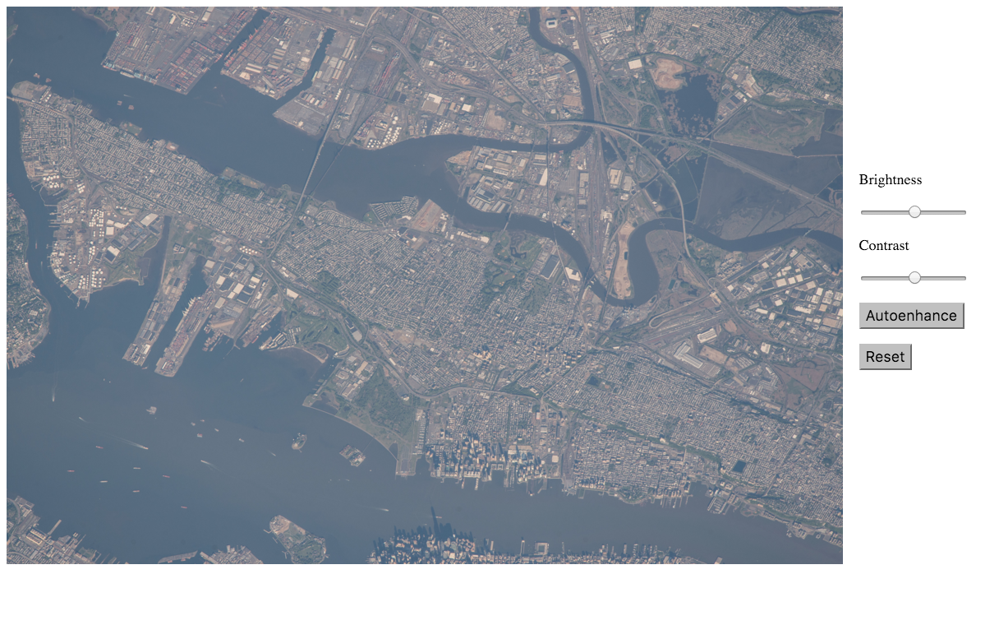

# Georef-Autoenhance-App
## Author 
Ashe Magalhaes 
* Internship, NASA Ames 
* Fall 2015 - Spring 2016 

## Description 
* Feature for Georef software, developed by Geocam Space group 
* Allows clients to enhance the imagery being geolocated
* Features include brightness and contrast sliders as well as histogram stretching autonenhance function 
* Focus on making app compatible with existing Django framework 

## Issues  
Save feature 
  * For quick brightness/slider feature, app relies on CSS changes generated from 'webkitz' function 
  * Issue with rendering CSS changes on images and saving 
  * Potential fix: Making image a SVG; issue with changing SVG source to 'autoenhanced' image 
  

  

